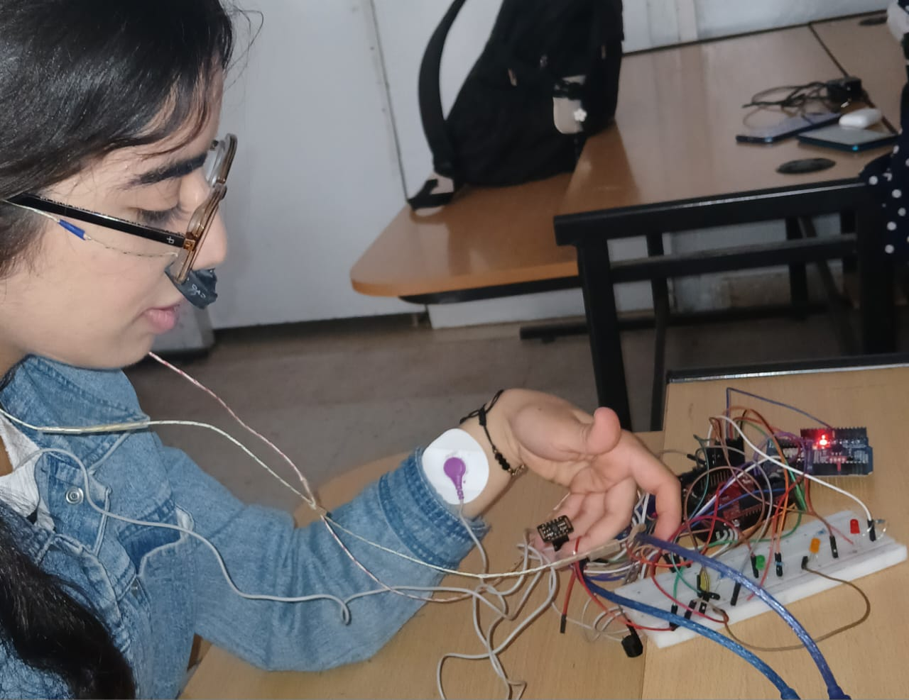
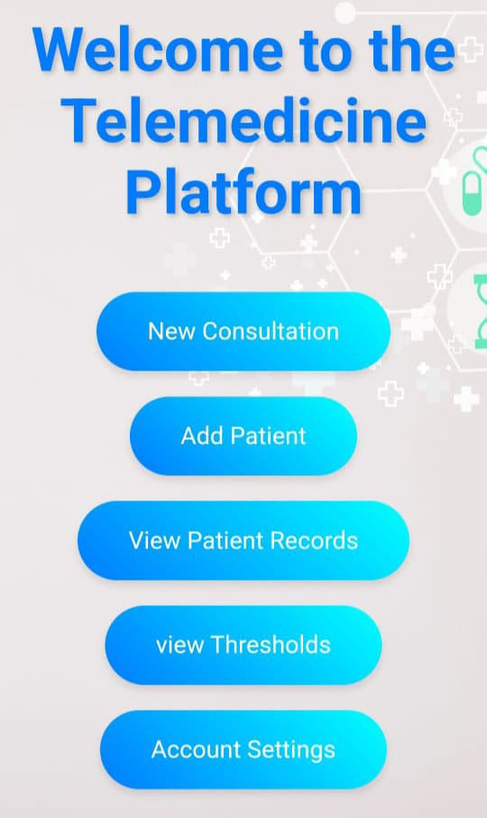
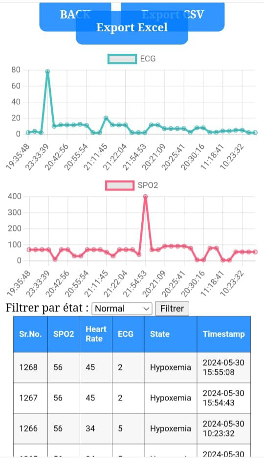
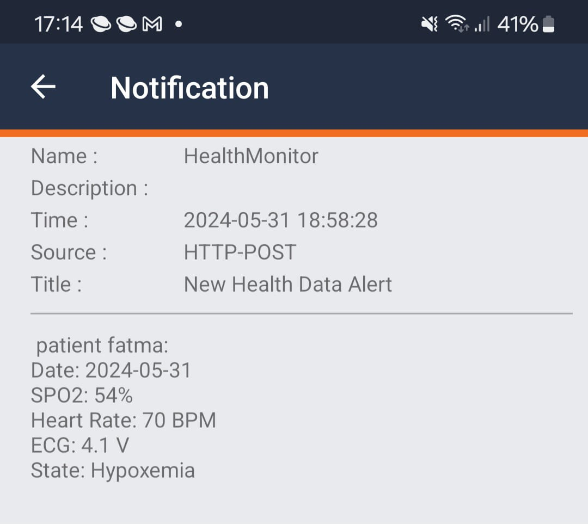
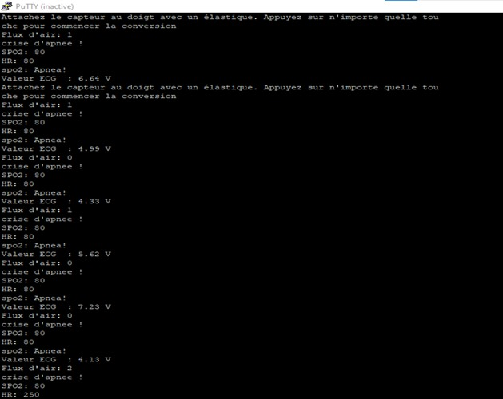

# SleepApnea Monitoring System

## Description  
SleepApnea is a connected medical device system designed to monitor and detect obstructive sleep apnea syndrome (OSAS). It records and analyzes physiological signals during sleep to identify apnea events and help in diagnosis and treatment follow-up.

## Key Features  
- Continuous monitoring of respiratory and oxygen saturation signals during sleep.  
- Detection and classification of apnea events.  
- Data visualization via an easy-to-use interface.  
- Alerts and reports generation for medical review.  
- Portable and user-friendly design for home use.

## Screenshots
   
*Award received at the Digital Health Forum.*
 
  
*Photo of the monitoring device and equipment.*

  
*First user interface showing sleep data overview.*

  
*Detailed view of detected apnea events.*

  
*Sample alert notification for apnea detection.*

  
*Summary of monitoring results.*

## Benefits  
- Early detection of sleep apnea for better treatment outcomes.  
- Enables remote monitoring by healthcare professionals.  
- Improves patient comfort with non-invasive design.  
- Facilitates long-term follow-up and data analysis.

## Contact  
Khouloud Othmani  
📧 Email: othmanikhouloud0@gmail.com  
🔗 LinkedIn: https://www.linkedin.com/in/khouloud-othmani-1566412b2
